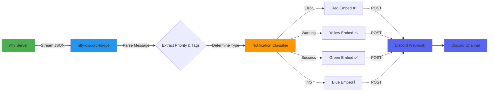

# ntfy-discord-bridge

[](https://github.com/SirCypkowskyy/ntfy-discord-bridge)
[](https://github.com/SirCypkowskyy/ntfy-discord-bridge/stargazers)
[](https://github.com/SirCypkowskyy/ntfy-discord-bridge/network)
[](https://www.python.org/downloads/)

A service that forwards notifications from [ntfy](https://ntfy.sh/) topics to Discord webhooks, deployable via Docker.

**[🇵🇱 Polska wersja README](README.pl.md)** | **[🇬🇧 English README](README.md)**

## Table of Contents

- [Overview](#overview)
- [Features](#features)
- [Highlights](#highlights)
- [Notification Types](#notification-types)
  - [Example](#example)
- [Architecture](#architecture)
- [Quick Start](#quick-start)
  - [1. Clone the repository](#1-clone-the-repository)
  - [2. Run with Docker Compose](#2-run-with-docker-compose)
  - [3. Add a mapping using CLI](#3-add-a-mapping-using-cli)
- [CLI Usage](#cli-usage)
  - [List all mappings](#list-all-mappings)
  - [Add a new mapping](#add-a-new-mapping)
    - [Basic mapping (no authentication)](#basic-mapping-no-authentication)
    - [With Basic authentication](#with-basic-authentication)
    - [With Bearer token authentication](#with-bearer-token-authentication)
  - [Remove a mapping](#remove-a-mapping)
  - [Local CLI usage (without Docker)](#local-cli-usage-without-docker)
- [How It Works](#how-it-works)


## Overview

**ntfy-discord-bridge** connects your [ntfy](https://ntfy.sh/) notifications directly to Discord channels via webhooks. It supports multiple mappings and secure connections, and can be managed easily using its CLI or run in Docker.

## Features

- Listens to one or more ntfy topics and streams messages to Discord webhooks.
- **Smart notification classification**: Automatically detects notification types (info, success, warning, error) based on priority and tags.
- **Rich Discord embeds**: Color-coded messages with emojis for visual distinction.
- Supports authenticated ntfy servers (Basic and Bearer).
- Dynamic management: add or remove mappings at runtime without restart.
- Robust error handling and automatic reconnection/backoff.
- Simple management CLI (`cli.py`): add/list/remove topic-to-webhook mappings.
- Easy deployment with Docker/Docker Compose.
- Written in Python 3.11+.

## Highlights

- **Docker-ready:** Ships with a Dockerfile and docker-compose configuration for production deployments.
- **CLI management:** Use the CLI tool to add, list, or remove ntfy-to-Discord mappings (see below).
- **Persistent mappings:** All mappings are stored in a persistent volume, so container restarts retain your configuration.
- **Intelligent notification routing:** Automatically formats Discord messages with appropriate colors and emojis based on ntfy priority and tags.

## Notification Types

The bridge automatically classifies notifications into different types based on ntfy priority and tags, providing visual distinction in Discord:

| Type | Priority | Tags | Discord Color | Emoji | Description |
|------|----------|------|---------------|-------|-------------|
| **Error** | 5 / `urgent` | `error`, `skull`, `rotating_light`, `fire`, `boom` | 🔴 Red | ❌ | Critical alerts requiring immediate attention |
| **Warning** | 4 / `high` | `warning`, `exclamation`, `construction` | 🟡 Yellow | ⚠️ | Important notifications that should be noticed |
| **Success** | Any | `white_check_mark`, `heavy_check_mark`, `partying_face`, `tada`, `check` | 🟢 Green | ✅ | Success confirmations and positive events |
| **Info** | 1-3 / `default`, `low`, `minimal` | (none) | 🔵 Blue | ℹ️ | General informational messages |

**Note:** Tags take precedence over priority when determining notification type. For example, a message with `Priority: urgent` and `Tags: warning` will be displayed as a warning (yellow) rather than an error (red).

### Example

```bash
curl -H "Title: Backup completed" \
     -H "Priority: high" \
     -H "Tags: white_check_mark" \
     -d "Database backup finished successfully" \
     ntfy.sh/my-topic
```

This will appear in Discord as a **success** notification (green, ✅) because the `white_check_mark` tag overrides the high priority.

## Architecture

The following diagram illustrates how notifications flow from ntfy to Discord:



## Quick Start

### 1. Clone the repository

```bash
git clone https://github.com/SirCypkowskyy/ntfy-discord-bridge.git
cd ntfy-discord-bridge
```

### 2. Run with Docker Compose

```bash
docker compose up -d
```

### 3. Add a mapping using CLI

Once the container is running, use the CLI to manage mappings:

```bash
docker exec -it ntfy-discord-bridge cli add \
    --server https://ntfy.sh \
    --topic your-ntfy-topic \
    --webhook <YOUR_DISCORD_WEBHOOK_URL>
```

The container will automatically detect new mappings and start forwarding notifications.

## CLI Usage

The CLI tool (`cli`) is available inside the Docker container and can be used to manage your ntfy-to-Discord mappings.

### List all mappings

View all active mappings:

```bash
docker exec -it ntfy-discord-bridge cli list
```

This will display a table with:
- **ID**: Unique identifier for each mapping
- **Ntfy Server**: The ntfy server URL
- **Ntfy Topic**: The topic name
- **Discord Webhook**: The Discord webhook URL (truncated for security)
- **Auth**: Authentication method used (None, Basic, or Bearer Token)

### Add a new mapping

#### Basic mapping (no authentication)

```bash
docker exec -it ntfy-discord-bridge cli add \
    --server https://ntfy.sh \
    --topic my-topic \
    --webhook https://discord.com/api/webhooks/YOUR_WEBHOOK_ID/YOUR_WEBHOOK_TOKEN
```

#### With Basic authentication

```bash
docker exec -it ntfy-discord-bridge cli add \
    --server https://ntfy.sh \
    --topic my-secure-topic \
    --webhook https://discord.com/api/webhooks/YOUR_WEBHOOK_ID/YOUR_WEBHOOK_TOKEN \
    --basic username password
```

#### With Bearer token authentication

```bash
docker exec -it ntfy-discord-bridge cli add \
    --server https://ntfy.sh \
    --topic my-secure-topic \
    --webhook https://discord.com/api/webhooks/YOUR_WEBHOOK_ID/YOUR_WEBHOOK_TOKEN \
    --token YOUR_BEARER_TOKEN
```

### Remove a mapping

Remove a mapping by its ID (use `cli list` to find the ID):

```bash
docker exec -it ntfy-discord-bridge cli remove --id 1
```

### Local CLI usage (without Docker)

If you're running the service locally, you can use the CLI directly:

```bash
# Make sure dependencies are installed
uv sync

# Use the CLI
python cli.py list
python cli.py add --server https://ntfy.sh --topic test --webhook <WEBHOOK_URL>
python cli.py remove --id 1
```

Or if the file is executable:

```bash
./cli.py list
./cli.py add --server https://ntfy.sh --topic test --webhook <WEBHOOK_URL>
./cli.py remove --id 1
```

## How It Works

1. **Subscribe to ntfy topics**: The bridge connects to one or more ntfy topics via HTTP streaming.
2. **Receive messages**: Messages arrive as NDJSON (newline-delimited JSON) streams.
3. **Classify notifications**: Each message is analyzed for priority and tags to determine its type.
4. **Format for Discord**: Messages are formatted as Discord embeds with appropriate colors and emojis.
5. **Forward to Discord**: Formatted messages are sent to configured Discord webhooks.

The service automatically handles reconnections, retries, and error recovery, ensuring reliable message delivery.

---

See the [CLI documentation](cli.py) and [main.py](main.py) for advanced usage and configuration details.