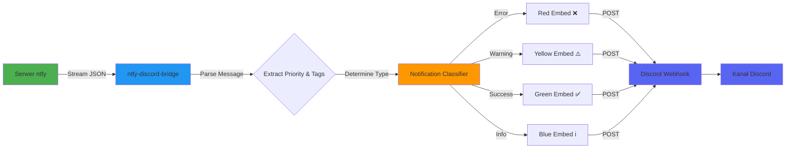

# ntfy-discord-bridge

[](https://github.com/SirCypkowskyy/ntfy-discord-bridge)
[](https://github.com/SirCypkowskyy/ntfy-discord-bridge/stargazers)
[](https://github.com/SirCypkowskyy/ntfy-discord-bridge/network)
[](https://www.python.org/downloads/)

Serwis przekierowujący powiadomienia z tematów [ntfy](https://ntfy.sh/) do webhooków Discord, możliwy do wdrożenia za pomocą Dockera.

**[🇬🇧 English README](README.md)** | **[🇵🇱 Polska wersja README](README.pl.md)**

## Spis treści

- [Przegląd](#przegląd)
- [Funkcje](#funkcje)
- [Najważniejsze cechy](#najważniejsze-cechy)
- [Typy powiadomień](#typy-powiadomień)
  - [Przykład](#przykład)
- [Architektura](#architektura)
- [Szybki start](#szybki-start)
  - [1. Sklonuj repozytorium](#1-sklonuj-repozytorium)
  - [2. Uruchom za pomocą Docker Compose](#2-uruchom-za-pomocą-docker-compose)
  - [3. Dodaj mapowanie używając CLI](#3-dodaj-mapowanie-używając-cli)
- [Użycie CLI](#użycie-cli)
  - [Wyświetl wszystkie mapowania](#wyświetl-wszystkie-mapowania)
  - [Dodaj nowe mapowanie](#dodaj-nowe-mapowanie)
    - [Podstawowe mapowanie (bez uwierzytelniania)](#podstawowe-mapowanie-bez-uwierzytelniania)
    - [Z uwierzytelnianiem Basic](#z-uwierzytelnianiem-basic)
    - [Z uwierzytelnianiem Bearer token](#z-uwierzytelnianiem-bearer-token)
  - [Usuń mapowanie](#usuń-mapowanie)
  - [Lokalne użycie CLI (bez Dockera)](#lokalne-użycie-cli-bez-dockera)
- [Jak to działa](#jak-to-działa)


## Przegląd

**ntfy-discord-bridge** łączy Twoje powiadomienia [ntfy](https://ntfy.sh/) bezpośrednio z kanałami Discord za pomocą webhooków. Obsługuje wiele mapowań i bezpieczne połączenia, a także może być łatwo zarządzany za pomocą CLI lub uruchamiany w Dockerze.

## Funkcje

- Nasłuchuje jeden lub więcej tematów ntfy i przesyła wiadomości do webhooków Discord.
- **Inteligentna klasyfikacja powiadomień**: Automatycznie wykrywa typy powiadomień (info, sukces, ostrzeżenie, błąd) na podstawie priorytetu i tagów.
- **Bogate osadzenia Discord**: Wiadomości z kodowaniem kolorów i emoji dla wizualnego rozróżnienia.
- Obsługuje uwierzytelnione serwery ntfy (Basic i Bearer).
- Dynamiczne zarządzanie: dodawaj lub usuwaj mapowania w czasie rzeczywistym bez restartu.
- Solidna obsługa błędów i automatyczne ponowne połączenie/backoff.
- Proste narzędzie zarządzania CLI (`cli.py`): dodawaj/wyświetlaj/usuwaj mapowania tematów do webhooków.
- Łatwe wdrożenie za pomocą Docker/Docker Compose.
- Napisane w Pythonie 3.11+.

## Najważniejsze cechy

- **Gotowe do Dockera:** Dostarczane z plikiem Dockerfile i konfiguracją docker-compose do wdrożeń produkcyjnych.
- **Zarządzanie CLI:** Użyj narzędzia CLI, aby dodawać, wyświetlać lub usuwać mapowania ntfy-to-Discord (patrz poniżej).
- **Trwałe mapowania:** Wszystkie mapowania są przechowywane w trwałym wolumenie, więc restart kontenera zachowuje Twoją konfigurację.
- **Inteligentne routowanie powiadomień:** Automatycznie formatuje wiadomości Discord z odpowiednimi kolorami i emoji na podstawie priorytetu i tagów ntfy.

## Typy powiadomień

Most automatycznie klasyfikuje powiadomienia na różne typy na podstawie priorytetu i tagów ntfy, zapewniając wizualne rozróżnienie w Discord:

| Typ | Priorytet | Tagi | Kolor Discord | Emoji | Opis |
|------|----------|------|---------------|-------|-------------|
| **Błąd** | 5 / `urgent` | `error`, `skull`, `rotating_light`, `fire`, `boom` | 🔴 Czerwony | ❌ | Krytyczne alerty wymagające natychmiastowej uwagi |
| **Ostrzeżenie** | 4 / `high` | `warning`, `exclamation`, `construction` | 🟡 Żółty | ⚠️ | Ważne powiadomienia, które powinny być zauważone |
| **Sukces** | Dowolny | `white_check_mark`, `heavy_check_mark`, `partying_face`, `tada`, `check` | 🟢 Zielony | ✅ | Potwierdzenia sukcesu i pozytywne wydarzenia |
| **Info** | 1-3 / `default`, `low`, `minimal` | (brak) | 🔵 Niebieski | ℹ️ | Ogólne wiadomości informacyjne |

**Uwaga:** Tagi mają pierwszeństwo przed priorytetem przy określaniu typu powiadomienia. Na przykład wiadomość z `Priority: urgent` i `Tags: warning` będzie wyświetlana jako ostrzeżenie (żółte) zamiast błędu (czerwone).

### Przykład

```bash
curl -H "Title: Backup completed" \
     -H "Priority: high" \
     -H "Tags: white_check_mark" \
     -d "Database backup finished successfully" \
     ntfy.sh/my-topic
```

To pojawi się w Discord jako powiadomienie o **sukcesie** (zielone, ✅), ponieważ tag `white_check_mark` nadpisuje wysoki priorytet.

## Architektura

Poniższy diagram ilustruje, jak powiadomienia przepływają z ntfy do Discord:



## Szybki start

### 1. Sklonuj repozytorium

```bash
git clone https://github.com/SirCypkowskyy/ntfy-discord-bridge.git
cd ntfy-discord-bridge
```

### 2. Uruchom za pomocą Docker Compose

```bash
docker compose up -d
```

### 3. Dodaj mapowanie używając CLI

Gdy kontener działa, użyj CLI do zarządzania mapowaniami:

```bash
docker exec -it ntfy-discord-bridge cli add \
    --server https://ntfy.sh \
    --topic your-ntfy-topic \
    --webhook <YOUR_DISCORD_WEBHOOK_URL>
```

Kontener automatycznie wykryje nowe mapowania i zacznie przekierowywać powiadomienia.

## Użycie CLI

Narzędzie CLI (`cli`) jest dostępne wewnątrz kontenera Docker i może być używane do zarządzania mapowaniami ntfy-to-Discord.

### Wyświetl wszystkie mapowania

Wyświetl wszystkie aktywne mapowania:

```bash
docker exec -it ntfy-discord-bridge cli list
```

To wyświetli tabelę z:
- **ID**: Unikalny identyfikator każdego mapowania
- **Serwer Ntfy**: URL serwera ntfy
- **Temat Ntfy**: Nazwa tematu
- **Webhook Discord**: URL webhooka Discord (obcięty ze względów bezpieczeństwa)
- **Auth**: Metoda uwierzytelniania używana (None, Basic lub Bearer Token)

### Dodaj nowe mapowanie

#### Podstawowe mapowanie (bez uwierzytelniania)

```bash
docker exec -it ntfy-discord-bridge cli add \
    --server https://ntfy.sh \
    --topic my-topic \
    --webhook https://discord.com/api/webhooks/YOUR_WEBHOOK_ID/YOUR_WEBHOOK_TOKEN
```

#### Z uwierzytelnianiem Basic

```bash
docker exec -it ntfy-discord-bridge cli add \
    --server https://ntfy.sh \
    --topic my-secure-topic \
    --webhook https://discord.com/api/webhooks/YOUR_WEBHOOK_ID/YOUR_WEBHOOK_TOKEN \
    --basic username password
```

#### Z uwierzytelnianiem Bearer token

```bash
docker exec -it ntfy-discord-bridge cli add \
    --server https://ntfy.sh \
    --topic my-secure-topic \
    --webhook https://discord.com/api/webhooks/YOUR_WEBHOOK_ID/YOUR_WEBHOOK_TOKEN \
    --token YOUR_BEARER_TOKEN
```

### Usuń mapowanie

Usuń mapowanie według jego ID (użyj `cli list`, aby znaleźć ID):

```bash
docker exec -it ntfy-discord-bridge cli remove --id 1
```

### Lokalne użycie CLI (bez Dockera)

Jeśli uruchamiasz serwis lokalnie, możesz użyć CLI bezpośrednio:

```bash
# Upewnij się, że zależności są zainstalowane
uv sync

# Użyj CLI
python cli.py list
python cli.py add --server https://ntfy.sh --topic test --webhook <WEBHOOK_URL>
python cli.py remove --id 1
```

Lub jeśli plik jest wykonywalny:

```bash
./cli.py list
./cli.py add --server https://ntfy.sh --topic test --webhook <WEBHOOK_URL>
./cli.py remove --id 1
```

## Jak to działa

1. **Subskrybuj tematy ntfy**: Most łączy się z jednym lub więcej tematami ntfy za pomocą strumieniowania HTTP.
2. **Odbieraj wiadomości**: Wiadomości docierają jako strumienie NDJSON (newline-delimited JSON).
3. **Klasyfikuj powiadomienia**: Każda wiadomość jest analizowana pod kątem priorytetu i tagów, aby określić jej typ.
4. **Formatuj dla Discord**: Wiadomości są formatowane jako osadzenia Discord z odpowiednimi kolorami i emoji.
5. **Przekieruj do Discord**: Sformatowane wiadomości są wysyłane do skonfigurowanych webhooków Discord.

Serwis automatycznie obsługuje ponowne połączenia, ponowne próby i odzyskiwanie błędów, zapewniając niezawodną dostawę wiadomości.

---

Zobacz [dokumentację CLI](cli.py) i [main.py](main.py) dla zaawansowanego użycia i szczegółów konfiguracji.

